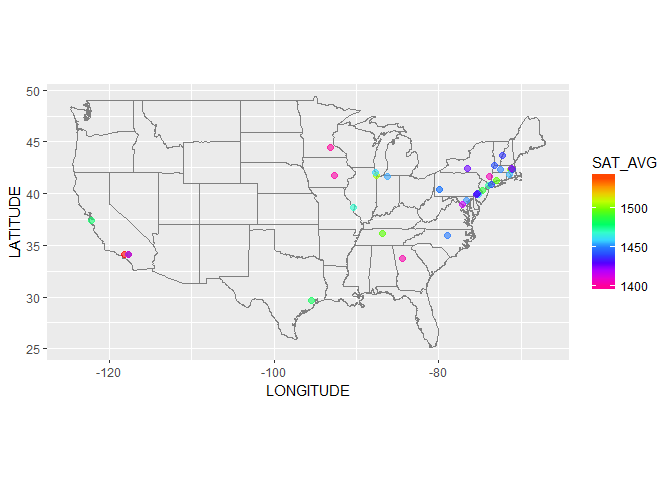
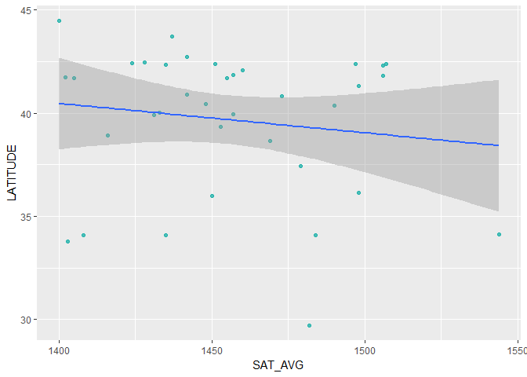

# Introduction

This package is needed for the United States map:

```r
library(maps)
```

```
## 
## Attaching package: 'maps'
```

```
## The following object is masked from 'package:purrr':
## 
##     map
```

# The SAT Average vs. the Location of the University

This paper looks at the relationship of the SAT average versus the location of the University.

## Cleaning and tidying the dataset


```r
college
```

```
## # A tibble: 7,593 x 1,777
##    UNITID OPEID  OPEID6 INSTNM   CITY  STABBR ZIP   ACCREDAGENCY   INSTURL
##     <int> <chr>  <chr>  <chr>    <chr> <chr>  <chr> <chr>          <chr>  
##  1 100654 00100~ 001002 Alabama~ Norm~ AL     35762 Southern Asso~ www.aa~
##  2 100663 00105~ 001052 Univers~ Birm~ AL     3529~ Southern Asso~ www.ua~
##  3 100690 02503~ 025034 Amridge~ Mont~ AL     3611~ Southern Asso~ www.am~
##  4 100706 00105~ 001055 Univers~ Hunt~ AL     35899 Southern Asso~ www.ua~
##  5 100724 00100~ 001005 Alabama~ Mont~ AL     3610~ Southern Asso~ www.al~
##  6 100751 00105~ 001051 The Uni~ Tusc~ AL     3548~ Southern Asso~ www.ua~
##  7 100760 00100~ 001007 Central~ Alex~ AL     35010 Southern Asso~ www.ca~
##  8 100812 00100~ 001008 Athens ~ Athe~ AL     35611 Southern Asso~ www.at~
##  9 100830 00831~ 008310 Auburn ~ Mont~ AL     3611~ Southern Asso~ www.au~
## 10 100858 00100~ 001009 Auburn ~ Aubu~ AL     36849 Southern Asso~ www.au~
## # ... with 7,583 more rows, and 1,768 more variables: NPCURL <chr>,
## #   SCH_DEG <int>, HCM2 <int>, MAIN <int>, NUMBRANCH <int>, PREDDEG <int>,
## #   HIGHDEG <int>, CONTROL <int>, ST_FIPS <int>, REGION <int>,
## #   LOCALE <int>, LOCALE2 <chr>, LATITUDE <dbl>, LONGITUDE <dbl>,
## #   CCBASIC <int>, CCUGPROF <int>, CCSIZSET <int>, HBCU <int>, PBI <int>,
## #   ANNHI <int>, TRIBAL <int>, AANAPII <int>, HSI <int>, NANTI <int>,
## #   MENONLY <int>, WOMENONLY <int>, RELAFFIL <int>, ADM_RATE <dbl>,
## #   ADM_RATE_ALL <dbl>, SATVR25 <int>, SATVR75 <int>, SATMT25 <int>,
## #   SATMT75 <int>, SATWR25 <int>, SATWR75 <int>, SATVRMID <int>,
## #   SATMTMID <int>, SATWRMID <int>, ACTCM25 <int>, ACTCM75 <int>,
## #   ACTEN25 <int>, ACTEN75 <int>, ACTMT25 <int>, ACTMT75 <int>,
## #   ACTWR25 <int>, ACTWR75 <int>, ACTCMMID <int>, ACTENMID <int>,
## #   ACTMTMID <int>, ACTWRMID <int>, SAT_AVG <int>, SAT_AVG_ALL <int>,
## #   PCIP01 <dbl>, PCIP03 <dbl>, PCIP04 <dbl>, PCIP05 <dbl>, PCIP09 <dbl>,
## #   PCIP10 <dbl>, PCIP11 <dbl>, PCIP12 <dbl>, PCIP13 <dbl>, PCIP14 <dbl>,
## #   PCIP15 <dbl>, PCIP16 <dbl>, PCIP19 <dbl>, PCIP22 <dbl>, PCIP23 <dbl>,
## #   PCIP24 <dbl>, PCIP25 <dbl>, PCIP26 <dbl>, PCIP27 <dbl>, PCIP29 <dbl>,
## #   PCIP30 <dbl>, PCIP31 <dbl>, PCIP38 <dbl>, PCIP39 <dbl>, PCIP40 <dbl>,
## #   PCIP41 <dbl>, PCIP42 <dbl>, PCIP43 <dbl>, PCIP44 <dbl>, PCIP45 <dbl>,
## #   PCIP46 <dbl>, PCIP47 <dbl>, PCIP48 <dbl>, PCIP49 <dbl>, PCIP50 <dbl>,
## #   PCIP51 <dbl>, PCIP52 <dbl>, PCIP54 <dbl>, CIP01CERT1 <int>,
## #   CIP01CERT2 <int>, CIP01ASSOC <int>, CIP01CERT4 <int>,
## #   CIP01BACHL <int>, CIP03CERT1 <int>, CIP03CERT2 <int>,
## #   CIP03ASSOC <int>, CIP03CERT4 <int>, CIP03BACHL <int>, ...
```

The first step in cleaning the dataset for my question is selecting all of the columns needed to answer the question regarding the location of the school, the name of the university, and its average SAT score.

```r
college_clean <- college %>%
  select(INSTNM, CITY, STABBR, REGION, LATITUDE, LONGITUDE, SAT_AVG) 
college_clean
```

```
## # A tibble: 7,593 x 7
##    INSTNM               CITY      STABBR REGION LATITUDE LONGITUDE SAT_AVG
##    <chr>                <chr>     <chr>   <int>    <dbl>     <dbl>   <int>
##  1 Alabama A & M Unive~ Normal    AL          5     34.8     -86.6     850
##  2 University of Alaba~ Birmingh~ AL          5     33.5     -86.8    1147
##  3 Amridge University   Montgome~ AL          5     32.4     -86.2      NA
##  4 University of Alaba~ Huntsvil~ AL          5     34.7     -86.6    1221
##  5 Alabama State Unive~ Montgome~ AL          5     32.4     -86.3     844
##  6 The University of A~ Tuscaloo~ AL          5     33.2     -87.5    1181
##  7 Central Alabama Com~ Alexande~ AL          5     32.9     -85.9      NA
##  8 Athens State Univer~ Athens    AL          5     34.8     -87.0      NA
##  9 Auburn University a~ Montgome~ AL          5     32.4     -86.2     990
## 10 Auburn University    Auburn    AL          5     32.6     -85.5    1218
## # ... with 7,583 more rows
```

The second step is to filter out all of the NA's, or "Not Avaliable" data that appears in the SAT_AVG and the SAT_AVG_ALL. Also renaming the columns that appear to have weird names that could have a clearer name such as INSTNM which I changed to UNIVERSITY_NAME. And STABBR which I changed to STATE. Then only looked at the schools with a SAT average of above 1000.

```r
college_clean2 <- college_clean %>%
  filter(!is.na(SAT_AVG))%>%
  rename(UNIVERSITY_NAME = INSTNM)%>%
  rename(STATE = STABBR)
college_clean2
```

```
## # A tibble: 1,278 x 7
##    UNIVERSITY_NAME         CITY    STATE REGION LATITUDE LONGITUDE SAT_AVG
##    <chr>                   <chr>   <chr>  <int>    <dbl>     <dbl>   <int>
##  1 Alabama A & M Universi~ Normal  AL         5     34.8     -86.6     850
##  2 University of Alabama ~ Birmin~ AL         5     33.5     -86.8    1147
##  3 University of Alabama ~ Huntsv~ AL         5     34.7     -86.6    1221
##  4 Alabama State Universi~ Montgo~ AL         5     32.4     -86.3     844
##  5 The University of Alab~ Tuscal~ AL         5     33.2     -87.5    1181
##  6 Auburn University at M~ Montgo~ AL         5     32.4     -86.2     990
##  7 Auburn University       Auburn  AL         5     32.6     -85.5    1218
##  8 Birmingham Southern Co~ Birmin~ AL         5     33.5     -86.9    1167
##  9 Faulkner University     Montgo~ AL         5     32.4     -86.2     985
## 10 Huntingdon College      Montgo~ AL         5     32.4     -86.3     992
## # ... with 1,268 more rows
```

The Third step is to just look at the top teir of universities to see where they are located. Then just for my own curiosity, I put the Universities in decending order to figure out the college with the hightest and the lowest SAT average. This will show where the top colleges are located, showing if there is any correlation between where a college is located and what their SAT average is.


```r
college_clean3 <- college_clean2 %>%
  filter(SAT_AVG >= 1400)%>%
  arrange(desc(SAT_AVG))
college_clean3
```

```
## # A tibble: 36 x 7
##    UNIVERSITY_NAME          CITY   STATE REGION LATITUDE LONGITUDE SAT_AVG
##    <chr>                    <chr>  <chr>  <int>    <dbl>     <dbl>   <int>
##  1 California Institute of~ Pasad~ CA         8     34.1    -118.     1544
##  2 Massachusetts Institute~ Cambr~ MA         1     42.4     -71.1    1507
##  3 University of Chicago    Chica~ IL         3     41.8     -87.6    1506
##  4 Franklin W Olin College~ Needh~ MA         1     42.3     -71.3    1506
##  5 Yale University          New H~ CT         1     41.3     -72.9    1498
##  6 Vanderbilt University    Nashv~ TN         5     36.1     -86.8    1498
##  7 Harvard University       Cambr~ MA         1     42.4     -71.1    1497
##  8 Princeton University     Princ~ NJ         2     40.3     -74.7    1490
##  9 Harvey Mudd College      Clare~ CA         8     34.1    -118.     1484
## 10 Rice University          Houst~ TX         6     29.7     -95.4    1482
## # ... with 26 more rows
```


## Exploratory data analysis

This graph of the United States shows the location, based on the longitude and the latitude, to directly show the correlation between where the top universities are located, and which has the highest average SAT scores. This Map graph shows that the top universities are located in the New England area and the top university is in California. Although this graph shows that the majority of the best colleges are in the northern part of the country there are still a few in the south that are also farly good as well. Although, in general, there are more top tier colleges in the north then there are in the south.


```r
college_clean3 %>%
ggplot(aes(LONGITUDE, LATITUDE))+
  borders("state")+
  geom_point(alpha = 0.6, size = 2, aes(color = SAT_AVG))+
  scale_color_gradientn(colors = rev(rainbow(10)))+
  coord_quickmap()
```

<!-- -->

This scatter plot shows the same thing as the graph above but in a way that is harder to understand. You can see a general pattern about location, but it is hard decipher what the graph means exactly. The majority of the top schools are in the northern part of the country but there are a few good ones in sothern areas such as California.


```r
college_clean3 %>%
  ggplot(mapping = aes(x = SAT_AVG, y = LATITUDE))+
  geom_point(alpha = 0.8, color = "lightseagreen")+
  stat_smooth(method = "lm")
```

<!-- -->


